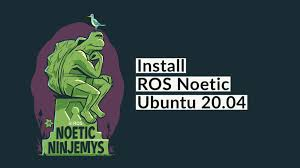

<h1 align="center"> ROBÓTICA INDUSTRIAL </h1>
 

Bienvenido al repositorio del curso de Robótica Industrial. Este curso está diseñado para estudiantes e investigadores interesados en el campo de la robótica.

# Instalación de ROS Noetic
El objetivo de la presente práctica es instalar y configurar el entorno de trabajo de ROS Noetic en Ubuntu 20.04, empleando una máquina virtual con VMWorkStation Player 17.

## Recursos Adicionales

Para complementar tu aprendizaje en el curso de Robótica, seguir los enlaces a recursos externos que podrían ser de tu interés:

Nota: Descargar VMware-player-17.5.2-23775571.exe.tar y descomprimir y ejecutar el archivo .exe

- [Descomprimir e instalar-VMware-player-17.5.2-23775571.exe.tar](https://softwareupdate.vmware.com/cds/vmw-desktop/player/17.5.2/23775571/windows/core/VMware-player-17.5.2-23775571.exe.tar)
  
- [ubuntu20.04](https://releases.ubuntu.com/focal/ubuntu-20.04.6-desktop-amd64.iso)
- [Documentación Oficial de ROS Noetic (Robot Operating System)](https://wiki.ros.org/noetic/Installation/Ubuntu)


### Instalación de Dependencias
Para configurar el entorno necesario para el curso en un sistema operativo Ubuntu, necesitarás instalar algunas dependencias y configurar tu entorno de desarrollo. 


<p align="center">
  <a href="https://youtu.be/7AlrIBRidAI">
    
  </a>
</p>

<p align="center">
<a href="https://youtu.be/7AlrIBRidAI" target="_blank">**Enlace a Instalación de Ubuntu y Ros Noetic - Haga clic aquí para más información**</a>
</p>

## Configuración de Máquina Virtual

```bash
sudo apt-get update
```
```bash
sudo apt-get install open-vm-tools-desktop -y
```
```bash
sudo reboot
```

### Instalación de Ros Noetic
```bash
Abre una terminal y sigue los siguientes pasos.
```


Paso 1 - Configura tu source.list:
```bash
sudo sh -c 'echo "deb http://packages.ros.org/ros/ubuntu $(lsb_release -sc) main" > /etc/apt/sources.list.d/ros-latest.list'
```
Paso 2 - Configura tus Keys:
```bash
sudo apt install curl # if you haven't already installed curl
```

```bash
curl -s https://raw.githubusercontent.com/ros/rosdistro/master/ros.asc | sudo apt-key add
```
Paso 3 - Instalación:
```bash
sudo apt update

```
```bash
sudo apt install ros-noetic-desktop-full
```
Paso 4 – Configuración del entorno:
```bash
echo "source /opt/ros/noetic/setup.bash" >> ~/.bashrc
```
```bash
source ~/.bashrc
```
Paso 5 – Dependencias para construir paquetes:

```bash
sudo apt install python3-rosdep python3-rosinstall python3-rosinstall-generator python3-wstool build-essential
```
Paso 6 – Inicializar rosdep

```bash
sudo apt install python3-rosdep
```

```bash
sudo rosdep init
```

```bash
rosdep update
```
### source ROS  environment

```bash
nano .bashrc
```
```bash
source /opt/ros/noetic/setup.bash
```
Actualizar bash:
```bash
source ~/.bashrc
```
### Instalar terminal:
```bash
sudo apt-get install terminator
```


### Revisar la versión de Ros instalada:
```bash
rosversion -d
```
### Ejecutar Ros
```bash
roscore 
```


## Configurar VsCode
```bash
sudo apt install python3-pip
```
```bash
pip install numpy
```
```bash
pip install matplotlib
```

